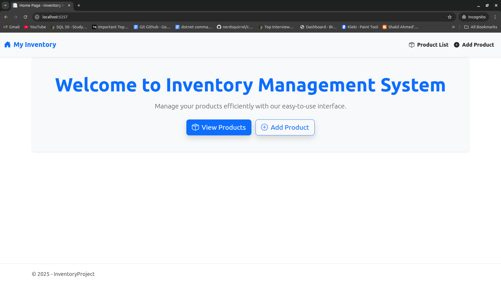
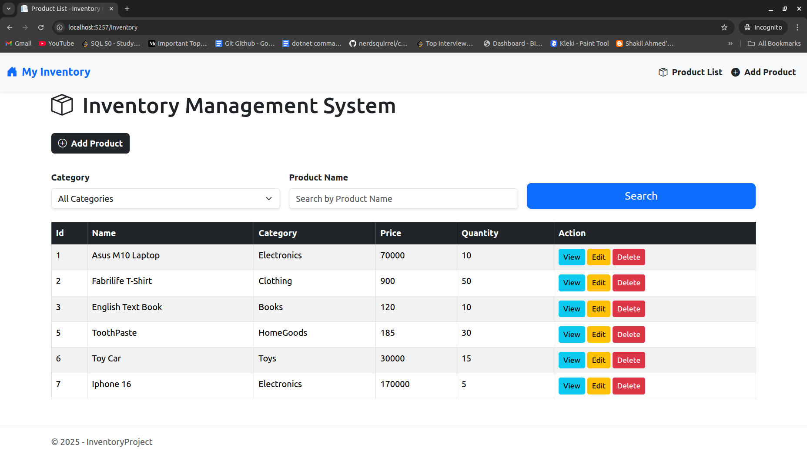
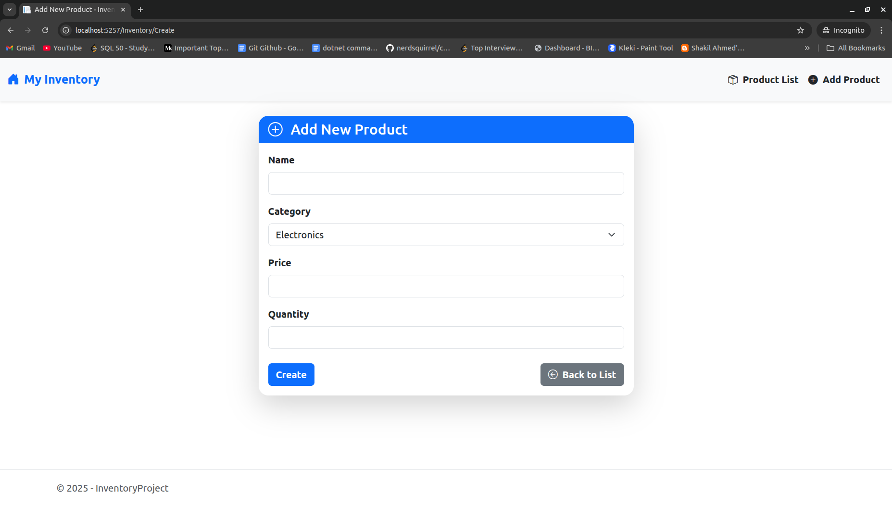
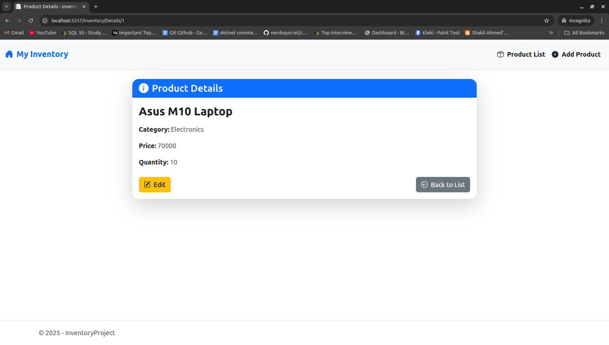
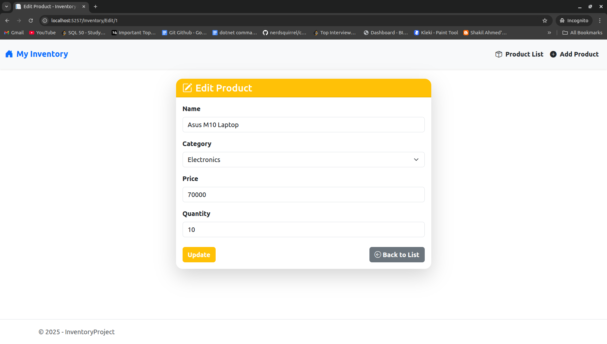
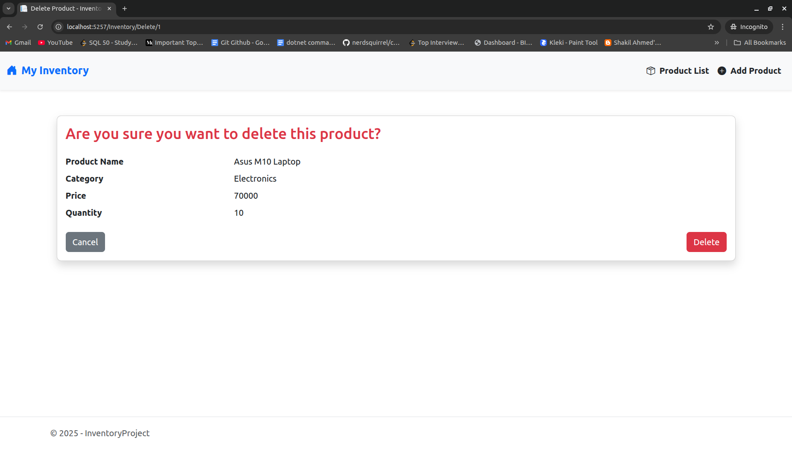
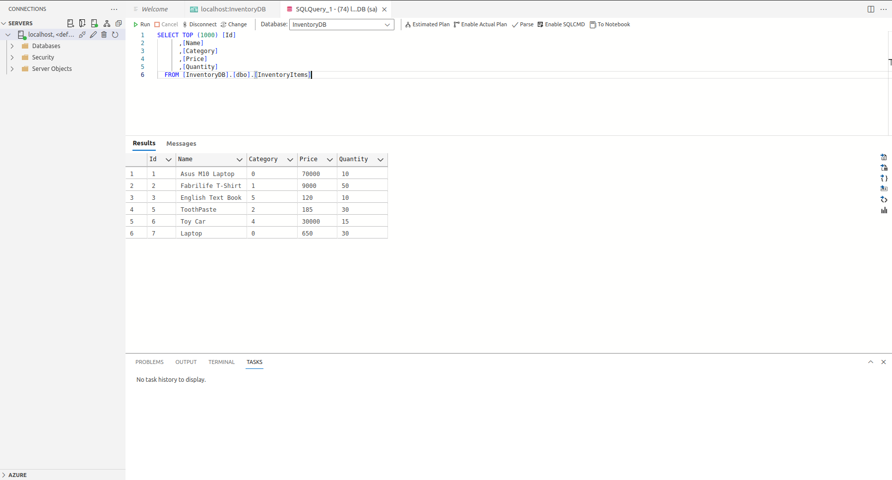

# 📦 Inventory Management System

A simple, user-friendly web application for managing products efficiently, built using ASP.NET Core with Razor Pages and SQL Server.

---

## 🖥️ Features

- ✅ Add new products with category, name, price and quantity
- 📋 View a list of all products
- 🔍 Search and filter by product name or category
- 📝 Edit product details
- 🗑️ Delete products with confirmation
- 📄 View detailed information about a product

---

## ⚙️ Tech Stack

- ASP.NET Core Razor Pages
- Entity Framework Core
- SQL Server
- Bootstrap 5 for responsive UI

---

## 📷 Screenshots

### 🏠 Home Page

### 📃 Product List (Index)

### ➕ Create Product

### 🔍 Product Details

### ✏️ Edit Product

### ❌ Delete Confirmation

### 🗄️ Database

---

🙋‍♂️ Author
Jahidul Islam
Competitive Programmer & .NET Developer
📧 jahidhridoy34@gmail.com
🔗 LinkedIn: [Jahidul Islam]([url](https://www.linkedin.com/in/jahidul-islam-788577243/))
